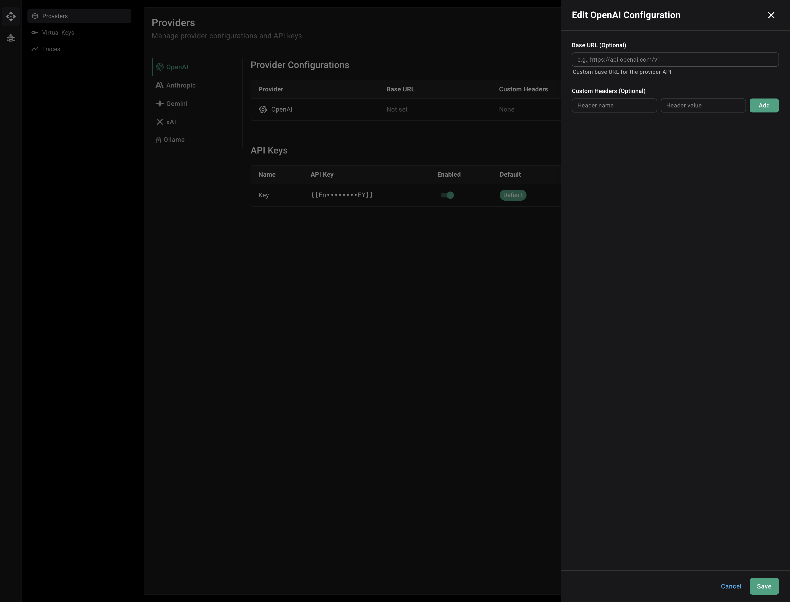
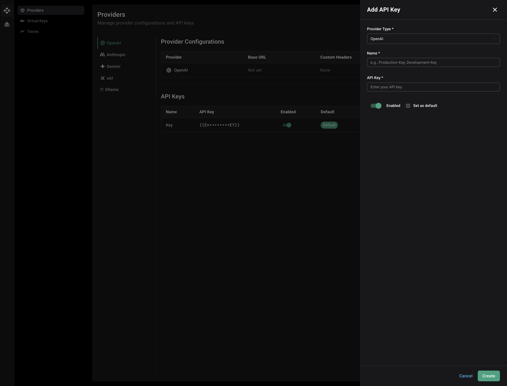

The Providers page allows you to configure and manage LLM providers for the Uno LLM Gateway. You can add API keys, configure base URLs, set custom headers, and use environment variables for secure key management.


The Providers page displays provider configurations and API keys in organized tables, with tabs for each supported provider.

## Supported Providers

The gateway supports the following LLM providers:

- **OpenAI** - GPT models (GPT-4, GPT-3.5, etc.)
- **Anthropic** - Claude models
- **Gemini** - Google's Gemini models
- **xAI** - Grok models
- **Ollama** - Self-hosted models

## Configuring Provider Settings

Each provider can be configured with custom base URLs and custom headers. This is useful for:

- Using proxy servers or custom endpoints
- Adding authentication headers
- Using compatible API endpoints

### Setting Base URL

To configure a custom base URL for a provider:

1. Navigate to the **Providers** page
2. Select the provider tab
3. Click the **Edit** button next to the provider name in the provider configuration table
4. In the **Base URL** field, enter your custom base URL (e.g., `https://api.openai.com/v1`)
5. Click **Save**

**Example use cases:**
- Using a proxy server: `https://proxy.example.com/openai`
- Using a compatible API endpoint: `https://api.example.com/v1`
- Self-hosted instances: `http://localhost:8080/v1`

### Adding Custom Headers

To add custom headers to provider requests:

1. Navigate to the **Providers** page
2. Select the provider tab
3. Click the **Edit** button next to the provider name
4. In the **Custom Headers** section:
   - Enter the **Header name** (e.g., `X-Custom-Auth`)
   - Enter the **Header value** (e.g., `Bearer token123` or `{{Env.CUSTOM_AUTH_TOKEN}}`)
   - Click **Add** to add the header
5. Click **Save**



The configuration dialog allows you to set both the base URL and custom headers for each provider.

**Note:** Custom headers can also use environment variable references using the `{{Env.VARIABLE_NAME}}` syntax.

**Example use cases:**
- Adding authentication tokens
- Setting custom API version headers
- Adding proxy authentication headers
- Using environment variables for header values

## Adding API Keys

To add an API key for a provider:

1. Navigate to the **Providers** page in the dashboard
2. Select the provider tab (OpenAI, Anthropic, Gemini, xAI, or Ollama)
3. Click the **Add API Key** button
4. Fill in the form:
   - **Provider Type**: Select the provider (pre-filled based on the selected tab)
   - **Name**: Enter a descriptive name (e.g., "Production Key", "Development Key")
   - **API Key**: Enter your API key or use an environment variable reference (see below)
   - **Enabled**: Toggle to enable or disable the key
   - **Set as default**: Check to make this the default key for the provider
5. Click **Create**



### Using Environment Variables for API Keys

Instead of storing API keys directly, you can reference environment variables using the `{{Env.VARIABLE_NAME}}` syntax. This is recommended for security and makes it easier to manage keys across different environments.

**Example:**

```
{{Env.OPENAI_API_KEY}}
```

When you add an API key with an environment variable reference:

1. Set the environment variable in your system or container:
   ```bash
   export OPENAI_API_KEY="sk-your-actual-key-here"
   ```

2. In the API Key field, enter:
   ```
   {{Env.OPENAI_API_KEY}}
   ```

3. The gateway will automatically resolve the environment variable when the API key is used.

**Benefits:**
- Keys are not stored in the database
- Easy to rotate keys by updating environment variables
- Different keys for different environments (dev, staging, production)
- Follows security best practices

**Note:** The environment variable must be set in the environment where the Uno LLM Gateway is running. The gateway reads environment variables at runtime when processing requests.
