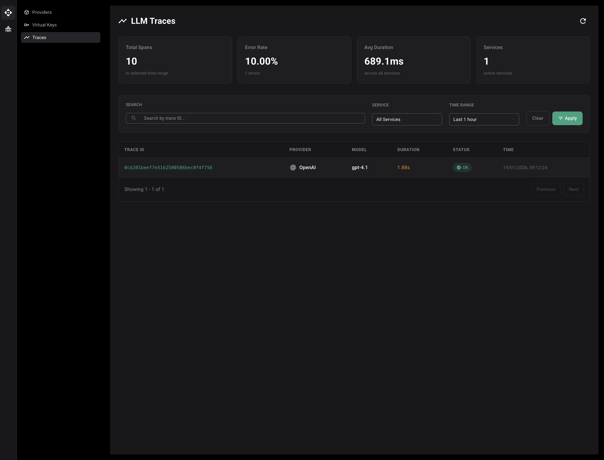

The Tracing page provides comprehensive observability for all LLM requests flowing through the Uno LLM Gateway. It allows you to monitor request performance, debug issues, and analyze usage patterns across different providers, models, and virtual keys.

The Traces page displays a summary dashboard with key metrics, search and filtering capabilities, and a detailed table of all LLM request traces.

## Overview

Tracing in the Uno LLM Gateway uses OpenTelemetry to collect and display detailed information about every LLM request. Each request generates a trace that includes:

- **Trace ID**: Unique identifier for the request
- **Provider**: Which LLM provider was used (OpenAI, Anthropic, Gemini, etc.)
- **Model**: Specific model that processed the request
- **Duration**: How long the request took to complete
- **Status**: Whether the request succeeded or failed
- **Timestamp**: When the request occurred

## Searching and Filtering Traces

The Traces page provides several ways to find specific traces:

### Search by Trace ID

1. Enter a trace ID in the **Search** field
2. The table will filter to show only matching traces

Trace IDs are unique identifiers that can be used to track a specific request through the system.

### Filter by Service

1. Click the **Service** dropdown
2. Select a specific service, or choose "All Services" to see all traces

This filter helps you focus on requests from specific applications or services.

### Filter by Time Range

1. Click the **Time Range** dropdown
2. Select a predefined time range:
   - Last 1 hour
   - Last 6 hours
   - Last 24 hours
   - Last 7 days
   - Last 30 days
   - Custom range

The time range filter updates the summary statistics and trace table to show only traces within the selected period.

### Applying Filters

1. Set your desired filters (Service, Time Range)
2. Optionally enter a trace ID in the search field
3. Click the **Apply** button to apply all filters
4. Click **Clear** to reset all filters to defaults
